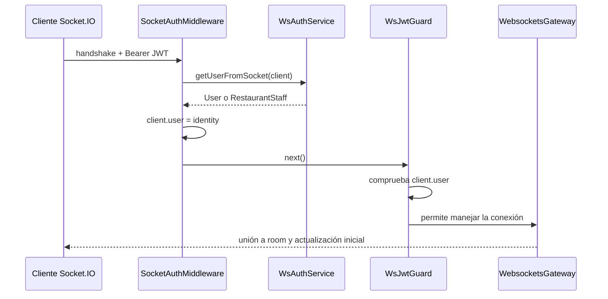

# Diseño: portfolio profesional, CV localizado y artículo técnico de NestJS

**Fecha:** 2026-09-12  
**Estado:** aprobado para planificación

## Objetivo

Actualizar el portfolio de Sergio Pezo con una narrativa profesional basada en
los CV completos de 2026, publicar un CV coherente en español,
inglés y portugués, y sustituir el artículo introductorio actual por un caso
técnico verificable sobre NestJS y autenticación JWT en WebSockets.

## Fuente de verdad

El CV español ubicado en `/home/sergi/Documents/me/cv/2026/completo/cv.tex` es la fuente canónica de
fechas, trayectoria y logros. En particular:

- Universidad Nacional de Ingeniería: 9.º ciclo;
- CoFoundy: marzo de 2025 a mayo de 2026;
- consultoría independiente: julio de 2026 a la actualidad;
- el contenido de los CV inglés y portugués debe expresar los mismos hechos.

La redacción inglesa existente en `/home/sergi/Documents/me/cv/2026/complete/cv.tex` puede servir
como base lingüística, pero sus datos inconsistentes deben alinearse con el CV
español.

## Alcance

### Incluido

1. Traducir el CV completo canónico al portugués y producir su PDF.
2. Corregir el CV completo en inglés para que coincida con los datos españoles.
3. Publicar tres PDF localizados como recursos estáticos del portfolio.
4. Actualizar la página CV en español, inglés y portugués con la trayectoria
   completa, manteniendo una lectura rápida para reclutadores.
5. Eliminar los tres artículos introductorios actuales y su portada genérica si
   deja de tener referencias.
6. Crear versiones equivalentes del nuevo artículo en español, inglés y
   portugués.
7. Renderizar diagramas Mermaid reales dentro de los artículos.
8. Mejorar la presentación editorial de artículos: índice, fragmentos de código,
   árbol de carpetas, diagramas, notas y bloques de decisión.

### Excluido

- rediseño integral del home, contacto o navegación;
- cambios funcionales en `en-mancha-backend`;
- afirmar que NestJS es universalmente superior a todos los frameworks;
- publicar secretos, tokens, identificadores reales o logs sensibles;
- reescribir la implementación del backend para que encaje con la narrativa.

## Decisión editorial

El título defenderá que NestJS es **el framework backend que mejor encaja con
Sergio**, no que sea objetivamente el mejor para todo proyecto. La tesis se
apoyará en experiencia concreta: módulos, inyección de dependencias, límites de
responsabilidad, integración con Socket.IO y una arquitectura capaz de crecer
como monolito modular.

El artículo corregirá una simplificación inicial: la implementación de EnMancha
no reemplaza completamente los guards. La autenticación se realiza durante el
handshake con middleware de Socket.IO; después, `WsJwtGuard` comprueba que el
socket ya tenga una identidad. Esta separación se presentará como:

- **middleware:** autenticar la conexión y enriquecer `client.user`;
- **guard:** autorizar el acceso al contexto del gateway;
- **gateway:** asignar rooms y ejecutar comportamiento de negocio.

## Estructura del artículo

1. Tesis personal: por qué NestJS encaja con mi forma de construir backend.
2. Contexto real: EnMancha como backend modular orientado a dominio.
3. El problema: autenticación HTTP frente al ciclo de una conexión WebSocket.
4. Arquitectura de carpetas relevante.
5. Secuencia del handshake autenticado.
6. `WsAuthService`: extracción, validación y resolución de identidad.
7. `SocketAuthMiddleware`: autenticación una sola vez al conectar.
8. `WebsocketsGateway.afterInit`: registro del middleware.
9. `WsJwtGuard`: frontera de autorización posterior.
10. Usuarios, personal de restaurante y asignación a rooms.
11. Por qué esta solución encaja con NestJS.
12. Trade-offs, límites y mejoras futuras.

Los fragmentos se basarán en archivos reales del backend, pero se editarán para
eliminar ruido y prácticas que no deben promoverse. En particular, no se
publicará el registro completo de `socket.handshake.headers`, porque puede
filtrar el bearer token a los logs.

## Arquitectura de contenido

Los datos localizados del CV permanecerán centralizados en `src/data.ts`, pero
se ampliarán con estructuras explícitas para experiencia, educación, proyectos,
premios, liderazgo y habilidades. La vista `cv.astro` solo presentará esos datos;
no contendrá hechos profesionales duplicados.

Cada locale tendrá una ruta estable hacia su PDF:

- español: `/cv/sergio-pezo-cv-es.pdf`;
- inglés: `/cv/sergio-pezo-cv-en.pdf`;
- portugués: `/cv/sergio-pezo-cv-pt.pdf`.

La página localizada abrirá y descargará el PDF de su propio idioma. No se
mostrará un selector adicional de tres archivos dentro de cada página: el
selector global de idioma ya cumple esa responsabilidad y evita duplicar
navegación.

## Renderizado de Mermaid

Se añadirá Mermaid como dependencia local y se inicializará solo en páginas que
contengan bloques `language-mermaid`. Un componente centrado en esta
responsabilidad transformará esos bloques en diagramas renderizados después de
la navegación inicial y de las transiciones de Astro.

Flujo esperado:



El código fuente del diagrama permanecerá en el DOM hasta que Mermaid complete
el renderizado. Ante un error, se mostrará el bloque original y no una sección
vacía. La inicialización respetará `prefers-reduced-motion`.

## Dirección visual

La actualización conservará la identidad actual para evitar un rediseño ajeno
al objetivo. El único gesto memorable será el flujo visual de la conexión
WebSocket en la portada y los diagramas.

### Color

- Azul arquitectura: `#46708E`.
- Marrón decisión: `#6F5542`.
- Papel claro: `#F7F4EE`.
- Superficie técnica: `#EEE5DA`.
- Tinta principal: `#2D2520`.
- Estado seguro: `#3F735D`.

### Tipografía

Se reutilizarán las familias ya cargadas por el layout para preservar
consistencia y rendimiento. El código usará la fuente monoespaciada existente o
la pila monoespaciada del sistema. La jerarquía dependerá de escala, peso y
espacio, no de etiquetas decorativas en mayúsculas.

### Layout

El artículo tendrá una columna principal de lectura limitada y un índice lateral
en pantallas amplias. En móvil, el índice será un bloque compacto al inicio.

```text
┌──────────────────────────────────────────────────┐
│ Título + tesis + diagrama de conexión            │
├──────────────┬───────────────────────────────────┤
│ Índice       │ Narrativa                         │
│ persistente  │ código · árbol · Mermaid · notas │
└──────────────┴───────────────────────────────────┘
```

La página CV dará prioridad a experiencia y proyectos. Los apartados secundarios
se agruparán sin convertir cada elemento en una tarjeta idéntica.

## Accesibilidad y comportamiento

- contraste suficiente para texto, enlaces y bloques de código;
- foco visible en enlaces, controles y acciones de copia;
- navegación por encabezados con identificadores estables;
- diagramas con texto alternativo o explicación equivalente;
- funcionamiento legible sin JavaScript;
- diseño responsive;
- animación no esencial desactivada con `prefers-reduced-motion`.

## Validación

Se seguirá TDD para la lógica añadida. Antes de implementar se crearán pruebas de
contrato que fallen al comprobar:

- correspondencia entre locale, contenido y PDF;
- presencia de las secciones completas del CV;
- ausencia de los artículos anteriores;
- existencia de tres variantes del nuevo artículo;
- presencia de bloques Mermaid y fragmentos de código esperados;
- transformación segura y reinicializable de bloques Mermaid.

Después se ejecutarán las pruebas y `npm run astro -- check`. Por restricción del
repositorio, no se ejecutará `npm run build` después de los cambios.

## Riesgos y mitigaciones

- **CV demasiado extenso en web:** usar jerarquía y contenido plegable solo si
  sigue siendo accesible; no eliminar logros canónicos.
- **Traducciones divergentes:** mantener las mismas entidades y fechas en los
  tres locales y cubrirlas con pruebas de contrato.
- **Mermaid rompe tras navegación:** inicializar también en `astro:page-load` y
  marcar nodos ya procesados.
- **Artículo promocional sin sustancia:** vincular cada conclusión con una
  decisión o fragmento real del backend.
- **Exposición de información sensible:** sanear snippets y excluir logs de
  headers y valores de configuración.

## Criterios de aceptación

1. Las tres rutas CV muestran los mismos hechos en su idioma.
2. Cada ruta abre y permite descargar su PDF localizado correcto.
3. Existe un CV completo en portugués equivalente al español.
4. Los artículos anteriores ya no aparecen ni generan rutas.
5. El nuevo artículo existe en tres idiomas con estructura equivalente.
6. Mermaid se renderiza visualmente y conserva fallback legible.
7. Los snippets corresponden a la arquitectura real sin exponer información
   sensible.
8. La narrativa distingue correctamente autenticación por middleware y
   autorización por guard.
9. Las pruebas de contrato y `astro check` pasan sin errores.
