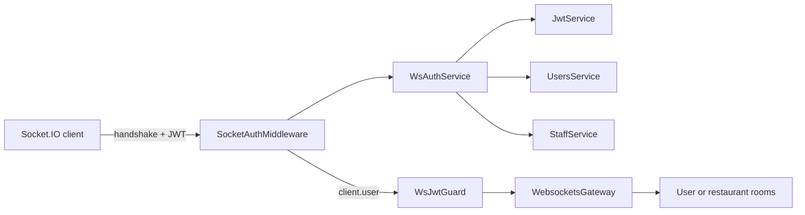
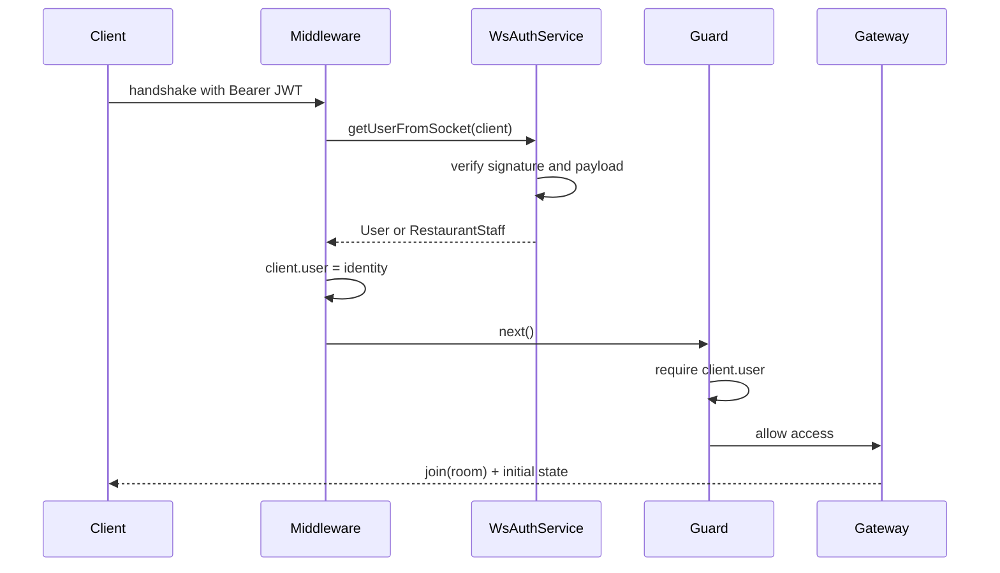
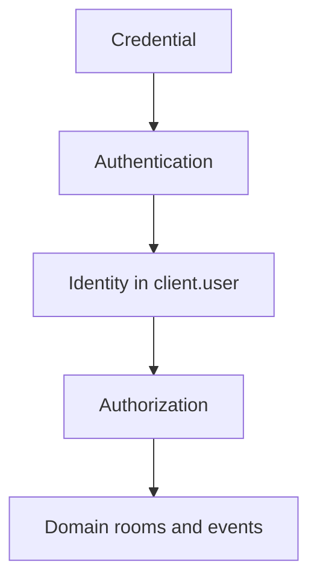

NestJS is not the best framework for every team or product. It has become the best backend tool **for me** because it makes the decisions I care about—boundaries, dependencies, and responsibilities—visible in code.

This is not a hello-world tutorial. It is the anatomy of a decision I made in EnMancha: authenticate a Socket.IO connection with JWT during the handshake, attach the identity to the socket, and let a guard enforce access afterwards.

## In this article

- [Why NestJS](#why-nestjs)
- [The WebSocket problem](#the-websocket-problem)
- [The architecture](#the-architecture)
- [The complete flow](#the-complete-flow)
- [Middleware and guards do not compete](#middleware-and-guards-do-not-compete)
- [What I would improve](#what-i-would-improve)

## Why NestJS

I value NestJS for something less flashy than decorators: it turns architecture into a visible contract. A module draws a boundary, a provider names a capability, and dependency injection shows who needs whom.

Express may be more direct for a small backend. FastAPI can be excellent for data-heavy services. But when a domain grows, several user types coexist, and HTTP, jobs, and real-time events meet, NestJS reduces accidental decisions.

> A framework does not replace judgment. It gives my team a shared language with which to apply and discuss it.

## The WebSocket problem

Every HTTP request re-enters the pipeline. A WebSocket connection negotiates once and then keeps a channel open. Waiting for the first event to validate JWT would mean accepting a connection whose identity was still unknown.

Before working with rooms I needed to reject invalid credentials, resolve either a regular user or restaurant staff member, and avoid verifying the same token for every message.

## The architecture

```text
src/websockets/
├── guards/ws-jwt.guard.ts
├── interfaces/socket-with-user.interface.ts
├── middlewares/ws.mw.ts
├── services/
│   ├── connection-manager.service.ts
│   └── ws-auth.service.ts
├── websockets.gateway.ts
└── websockets.module.ts
```



## The complete flow



### The socket contract

**`interfaces/socket-with-user.interface.ts`**

```ts
export interface SocketWithUser extends Socket {
  user: User | RestaurantStaff;
}
```

The type documents the pipeline's result: a socket reaching the gateway carries an identity.

### Resolving identity in one service

**`services/ws-auth.service.ts` — reduced version**

```ts
async getUserFromSocket(socket: SocketWithUser) {
  const token = this.extractTokenFromHandshake(socket);
  if (!token) throw new WsException('Unauthorized');

  const payload = this.jwtService.verify<JwtPayload>(token, {
    secret: this.configService.getOrThrow('JWT_SECRET'),
  });

  return payload.isStaff || payload.restaurantId
    ? this.staffService.findById(payload.sub)
    : this.usersService.findByIdAndLoadRole(payload.sub);
}
```

Signature verification and actor lookup form one operation: turning a credential into a domain identity.

### Authenticating at the handshake

**`middlewares/ws.mw.ts`**

```ts
export const SocketAuthMiddleware =
  (auth: WsAuthService, logger: Logger): SocketIOMiddleware =>
  async (client, next) => {
    try {
      client.user = await auth.getUserFromSocket(client);
      next();
    } catch (error) {
      logger.warn(`WebSocket authentication rejected: ${client.id}`);
      next(error);
    }
  };
```

Socket.IO middleware runs before the connection is accepted. The gateway never needs to clean up an anonymous socket afterwards.

**`websockets.gateway.ts`**

```ts
afterInit(server: Server) {
  server.use(SocketAuthMiddleware(this.wsAuthService, this.logger));
}
```

NestJS provides dependency injection and lifecycle hooks; Socket.IO provides the right protocol boundary.

## Middleware and guards do not compete

My first shorthand was “middleware instead of guards.” The code supports a more precise conclusion: **they solve different problems**.

```ts
canActivate(context: ExecutionContext): boolean {
  if (context.getType() !== 'ws') return true;
  const client = context.switchToWs().getClient<SocketWithUser>();
  if (!client.user) throw new WsException('Unauthorized');
  return true;
}
```

The middleware authenticates and enriches the connection. The guard understands execution context and authorizes continuation.



Customers and donees join `customer-{userId}`; owners and staff join `restaurant-{restaurantId}`; administrators join `admin`. Authentication delivers a trusted identity, while the gateway translates it into domain behavior.

## What I would improve

1. **Never log complete handshake headers.** They may contain the bearer token.
2. **Also accept `handshake.auth.token`.** It is often more natural for browser clients.
3. **Make `user` optional before middleware.** The current type describes the final, not initial, socket state.
4. **Use event-specific authorization policies.** Identity alone is not permission.
5. **Define expiration and revocation.** Long-lived connections need an explicit policy.

The important part was not merely making JWT work. It was assigning each decision to one focused component: service for identity, middleware for handshake, guard for context, and gateway for rooms and events. NestJS gives me the boundaries to express that architecture, which is why it fits the backend work I enjoy.

Related official references: NestJS [gateways](https://docs.nestjs.com/websockets/gateways) and [WebSocket guards](https://docs.nestjs.com/websockets/guards).
