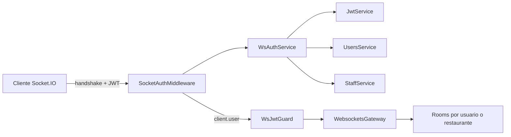
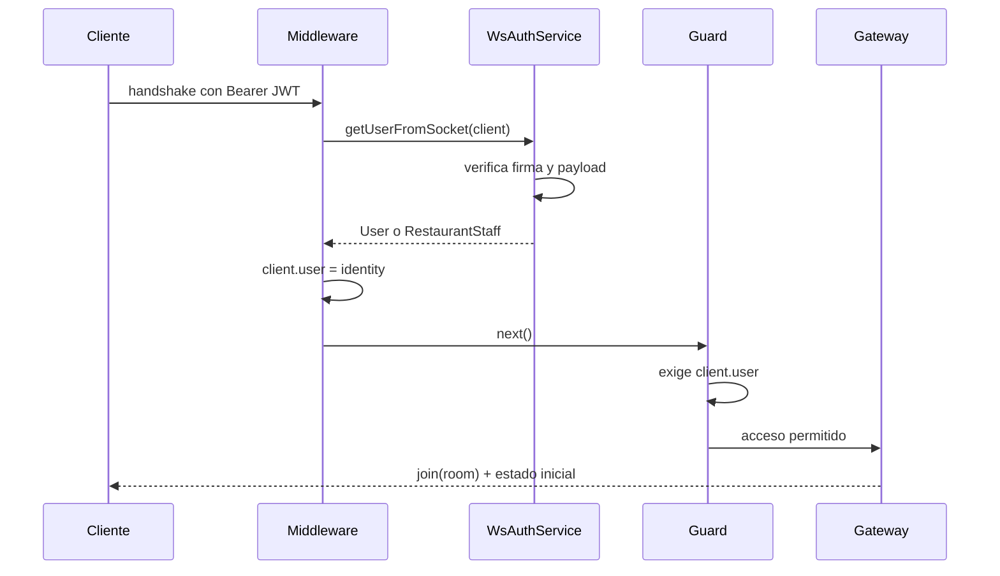
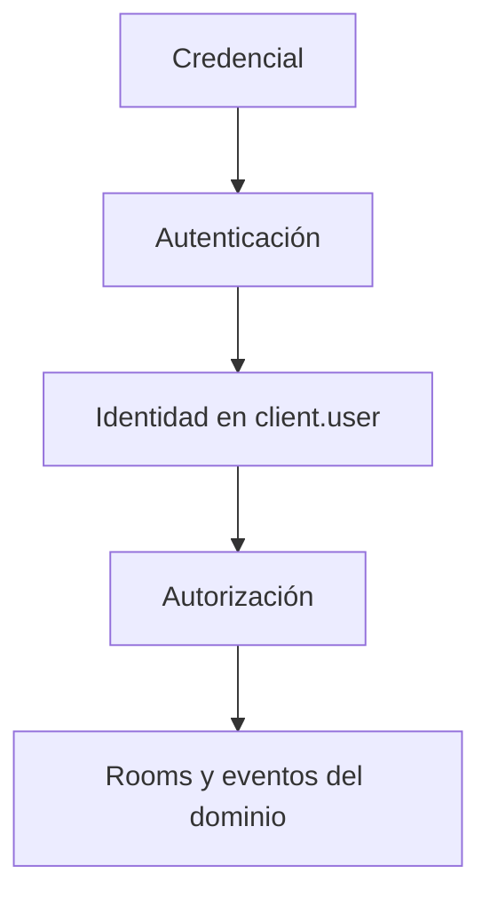

NestJS no es el mejor framework para cada equipo ni para cada producto. Para mí sí se ha convertido en la mejor herramienta de backend porque me obliga a hacer explícitas las decisiones que más me importan: **límites, dependencias y responsabilidades**.

Este no es un artículo de “hola mundo”. Es la anatomía de una decisión que tomé en EnMancha: autenticar una conexión Socket.IO con JWT durante el *handshake*, adjuntar la identidad al socket y dejar que un guard controle el acceso posterior.

## Mapa del artículo

- [Por qué NestJS](#por-qué-nestjs)
- [El problema con WebSockets](#el-problema-con-websockets)
- [La arquitectura](#la-arquitectura)
- [El flujo completo](#el-flujo-completo)
- [Middleware y guard no compiten](#middleware-y-guard-no-compiten)
- [Lo que mejoraría](#lo-que-mejoraría)

## Por qué NestJS

Me gusta NestJS por una razón menos vistosa que sus decoradores: convierte la arquitectura en código visible. Un módulo declara fronteras, un provider declara una capacidad y la inyección de dependencias muestra quién necesita a quién.

En un backend pequeño, Express puede ser más directo. En un servicio de datos intensivo, FastAPI puede ser una elección excelente. Pero cuando el dominio crece, hay varios tipos de usuario y conviven HTTP, tareas y eventos en tiempo real, la estructura de NestJS reduce decisiones accidentales.

> El framework no reemplaza el criterio. Me da un lenguaje común para aplicarlo y discutirlo con el equipo.

## El problema con WebSockets

En HTTP cada petición vuelve a atravesar el pipeline. Una conexión WebSocket negocia su identidad una vez y después mantiene un canal abierto. Si esperaba al primer evento para validar el token, aceptaba una conexión que todavía no sabía representar.

Necesitaba garantizar tres cosas antes de trabajar con rooms:

1. rechazar conexiones sin token o con un JWT inválido;
2. resolver si la identidad era un usuario normal o personal de restaurante;
3. dejar esa identidad disponible sin verificar el mismo token en cada mensaje.

## La arquitectura

La carpeta no agrupa archivos arbitrariamente. Cada pieza tiene una sola razón para cambiar:

```text
src/websockets/
├── guards/
│   └── ws-jwt.guard.ts
├── interfaces/
│   └── socket-with-user.interface.ts
├── middlewares/
│   └── ws.mw.ts
├── services/
│   ├── connection-manager.service.ts
│   └── ws-auth.service.ts
├── websockets.gateway.ts
└── websockets.module.ts
```



## El flujo completo



### 1. Un tipo de socket que expresa el contrato

**`interfaces/socket-with-user.interface.ts`**

```ts
export interface SocketWithUser extends Socket {
  user: User | RestaurantStaff;
}
```

No es solo comodidad de TypeScript. El tipo documenta el resultado esperado del pipeline: cuando el socket alcanza el gateway, tiene identidad.

### 2. Un servicio dedicado a resolver identidad

**`services/ws-auth.service.ts` — versión reducida**

```ts
async getUserFromSocket(socket: SocketWithUser) {
  const token = this.extractTokenFromHandshake(socket);
  if (!token) throw new WsException('Unauthorized');

  const payload = this.jwtService.verify<JwtPayload>(token, {
    secret: this.configService.getOrThrow('JWT_SECRET'),
  });

  return payload.isStaff || payload.restaurantId
    ? this.staffService.findById(payload.sub)
    : this.usersService.findByIdAndLoadRole(payload.sub);
}
```

La verificación criptográfica y la carga del actor viven juntas porque forman una operación: convertir una credencial en una identidad del dominio.

### 3. Middleware para autenticar la conexión

**`middlewares/ws.mw.ts` — esencia de la implementación**

```ts
export const SocketAuthMiddleware =
  (auth: WsAuthService, logger: Logger): SocketIOMiddleware =>
  async (client, next) => {
    try {
      client.user = await auth.getUserFromSocket(client);
      next();
    } catch (error) {
      logger.warn(`WebSocket authentication rejected: ${client.id}`);
      next(error);
    }
  };
```

El middleware de Socket.IO corre antes de aceptar la conexión. Si falla, el gateway no recibe un socket anónimo que luego deba limpiar.

### 4. Registro explícito en el ciclo del gateway

**`websockets.gateway.ts`**

```ts
afterInit(server: Server) {
  server.use(SocketAuthMiddleware(this.wsAuthService, this.logger));
}
```

NestJS sigue aportando inyección de dependencias y lifecycle hooks; Socket.IO aporta el punto correcto del protocolo para intervenir.

## Middleware y guard no compiten

Mi primera forma de contarlo era “middleware en lugar de guards”. El código demuestra algo más preciso: **middleware y guard resuelven problemas diferentes**.

**`guards/ws-jwt.guard.ts`**

```ts
canActivate(context: ExecutionContext): boolean {
  if (context.getType() !== 'ws') return true;

  const client = context.switchToWs().getClient<SocketWithUser>();
  if (!client.user) throw new WsException('Unauthorized');

  return true;
}
```

El middleware autentica y enriquece la conexión. El guard conoce el contexto de ejecución y decide si puede continuar. Esta distinción coincide con la propia separación conceptual de NestJS: el middleware es adecuado para autenticar y adjuntar datos; el guard es adecuado para autorizar con conocimiento del handler.



## Rooms según la identidad

Una vez autenticado, el gateway puede traducir roles a topología de eventos:

- clientes y donatarios entran en `customer-{userId}`;
- dueños y personal entran en `restaurant-{restaurantId}`;
- administradores entran en `admin`.

Así, la autenticación no decide comportamiento de negocio. Solo entrega una identidad confiable; el gateway decide qué canal le corresponde.

## Lo que mejoraría

Esta implementación resolvió el problema, pero no la considero terminada para siempre.

1. **Nunca registrar headers completos.** `socket.handshake.headers` puede contener el bearer token. Los logs deben guardar contexto operativo, no credenciales.
2. **Aceptar `handshake.auth.token`.** En clientes browser suele ser más natural que intentar controlar el header `Authorization`.
3. **Tipar `user` como opcional antes del middleware.** El tipo actual expresa el estado final, no el estado inicial del socket.
4. **Separar autenticación de autorización por roles.** El guard base exige identidad; guards o políticas específicas deberían decidir permisos por evento.
5. **Definir revocación.** Un JWT válido al conectar puede expirar durante una sesión larga. La estrategia debe decidir reconexión, expiración o revocación activa.

## Por qué esta solución confirma mi elección

Lo valioso no fue “hacer funcionar JWT”. Fue poder asignar cada decisión a una pieza pequeña: el servicio conoce autenticación, el middleware conoce el handshake, el guard conoce el contexto y el gateway conoce rooms y eventos.

Eso es lo que busco en una arquitectura: que el código explique por qué existe. NestJS no toma esas decisiones por mí, pero me da excelentes límites para expresarlas. Por eso, para la clase de backend que disfruto construir, es el framework que mejor encaja conmigo.

Documentación relacionada: [gateways](https://docs.nestjs.com/websockets/gateways) y [guards WebSocket](https://docs.nestjs.com/websockets/guards) de NestJS.
