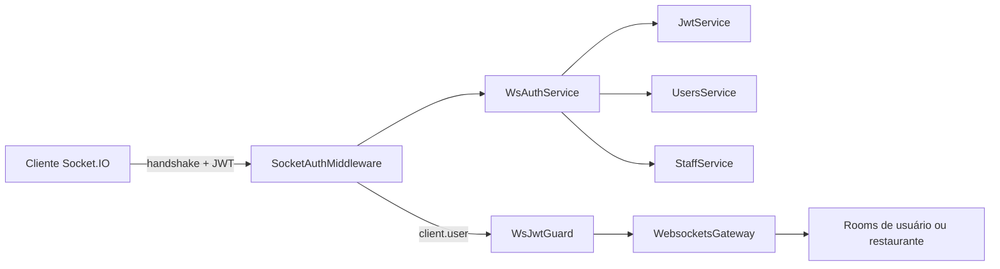
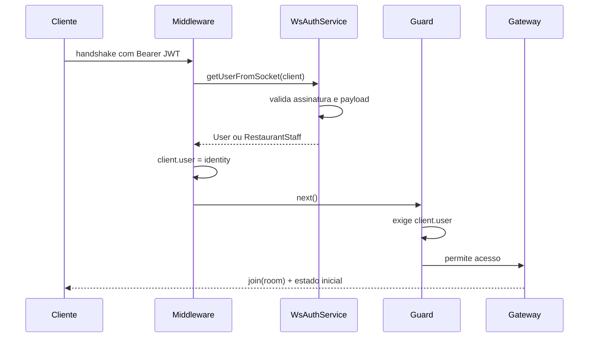
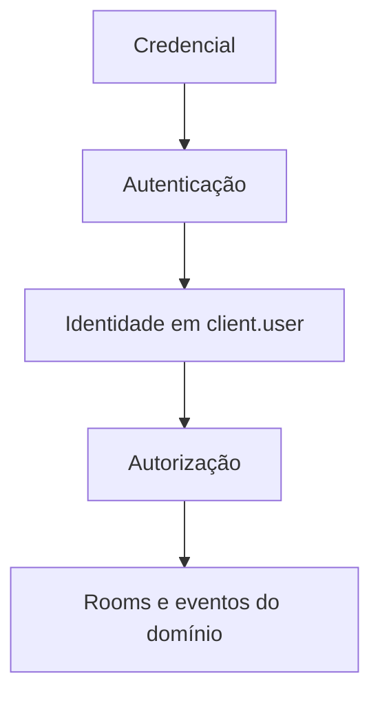

NestJS não é o melhor framework para toda equipe ou produto. Para mim, tornou-se a melhor ferramenta de backend porque deixa visíveis as decisões que mais valorizo: **limites, dependências e responsabilidades**.

Este não é um tutorial de “olá, mundo”. É a anatomia de uma decisão do EnMancha: autenticar uma conexão Socket.IO com JWT durante o *handshake*, anexar a identidade ao socket e deixar um guard controlar o acesso posterior.

## Neste artigo

- [Por que NestJS](#por-que-nestjs)
- [O problema com WebSockets](#o-problema-com-websockets)
- [A arquitetura](#a-arquitetura)
- [O fluxo completo](#o-fluxo-completo)
- [Middleware e guard não competem](#middleware-e-guard-não-competem)
- [O que eu melhoraria](#o-que-eu-melhoraria)

## Por que NestJS

Gosto do NestJS por algo menos chamativo que os decorators: ele transforma arquitetura em um contrato visível. Um módulo delimita uma fronteira, um provider nomeia uma capacidade e a injeção de dependências mostra quem precisa de quem.

Express pode ser mais direto em um backend pequeno. FastAPI pode ser excelente para serviços de dados. Mas quando o domínio cresce, existem vários tipos de usuário e HTTP, jobs e eventos em tempo real convivem, a estrutura do NestJS reduz decisões acidentais.

> O framework não substitui o critério. Ele oferece uma linguagem comum para aplicá-lo e discuti-lo.

## O problema com WebSockets

Cada requisição HTTP atravessa novamente o pipeline. Uma conexão WebSocket negocia sua identidade uma vez e mantém um canal aberto. Esperar o primeiro evento para validar o JWT significaria aceitar uma conexão ainda sem identidade.

Antes de usar rooms, eu precisava rejeitar credenciais inválidas, resolver se o ator era um usuário comum ou funcionário do restaurante e evitar validar o mesmo token em cada mensagem.

## A arquitetura

```text
src/websockets/
├── guards/ws-jwt.guard.ts
├── interfaces/socket-with-user.interface.ts
├── middlewares/ws.mw.ts
├── services/
│   ├── connection-manager.service.ts
│   └── ws-auth.service.ts
├── websockets.gateway.ts
└── websockets.module.ts
```



## O fluxo completo



### O contrato do socket

```ts
export interface SocketWithUser extends Socket {
  user: User | RestaurantStaff;
}
```

O tipo documenta o resultado esperado: quando o socket chega ao gateway, ele possui identidade.

### Um serviço para resolver identidade

**`services/ws-auth.service.ts` — versão reduzida**

```ts
async getUserFromSocket(socket: SocketWithUser) {
  const token = this.extractTokenFromHandshake(socket);
  if (!token) throw new WsException('Unauthorized');

  const payload = this.jwtService.verify<JwtPayload>(token, {
    secret: this.configService.getOrThrow('JWT_SECRET'),
  });

  return payload.isStaff || payload.restaurantId
    ? this.staffService.findById(payload.sub)
    : this.usersService.findByIdAndLoadRole(payload.sub);
}
```

Validar a assinatura e carregar o ator formam uma única operação: converter uma credencial em identidade de domínio.

### Autenticação no handshake

**`middlewares/ws.mw.ts`**

```ts
export const SocketAuthMiddleware =
  (auth: WsAuthService, logger: Logger): SocketIOMiddleware =>
  async (client, next) => {
    try {
      client.user = await auth.getUserFromSocket(client);
      next();
    } catch (error) {
      logger.warn(`WebSocket authentication rejected: ${client.id}`);
      next(error);
    }
  };
```

O middleware do Socket.IO executa antes que a conexão seja aceita. Assim, o gateway não precisa limpar um socket anônimo depois.

```ts
afterInit(server: Server) {
  server.use(SocketAuthMiddleware(this.wsAuthService, this.logger));
}
```

NestJS fornece injeção de dependências e lifecycle hooks; Socket.IO fornece o ponto correto do protocolo.

## Middleware e guard não competem

Minha primeira forma de resumir era “middleware em vez de guards”. O código mostra algo mais preciso: **eles resolvem problemas diferentes**.

```ts
canActivate(context: ExecutionContext): boolean {
  if (context.getType() !== 'ws') return true;
  const client = context.switchToWs().getClient<SocketWithUser>();
  if (!client.user) throw new WsException('Unauthorized');
  return true;
}
```

O middleware autentica e enriquece a conexão. O guard conhece o contexto de execução e autoriza a continuação.



Clientes e donatários entram em `customer-{userId}`; proprietários e funcionários em `restaurant-{restaurantId}`; administradores em `admin`. A autenticação entrega uma identidade confiável; o gateway a traduz em comportamento de domínio.

## O que eu melhoraria

1. **Nunca registrar os headers completos.** Eles podem conter o bearer token.
2. **Aceitar também `handshake.auth.token`.** É mais natural para muitos clientes browser.
3. **Tornar `user` opcional antes do middleware.** O tipo atual descreve o estado final.
4. **Criar políticas por evento.** Identidade não é o mesmo que permissão.
5. **Definir expiração e revogação.** Conexões longas precisam de uma política explícita.

O mais importante não foi apenas fazer o JWT funcionar. Foi atribuir cada decisão a um componente focado: serviço para identidade, middleware para handshake, guard para contexto e gateway para rooms e eventos. NestJS oferece os limites para expressar essa arquitetura; por isso combina tão bem com o backend que gosto de construir.

Referências oficiais: [gateways](https://docs.nestjs.com/websockets/gateways) e [guards WebSocket](https://docs.nestjs.com/websockets/guards) do NestJS.
